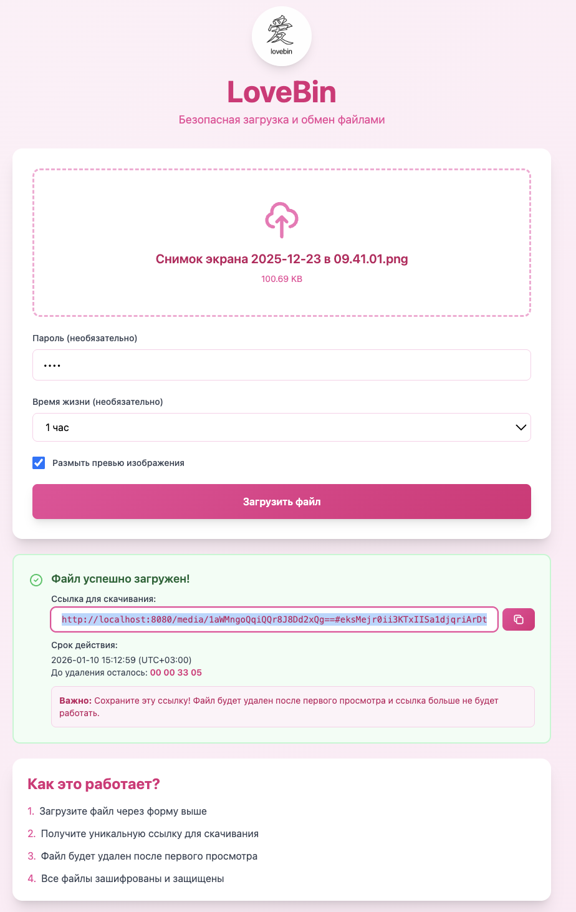
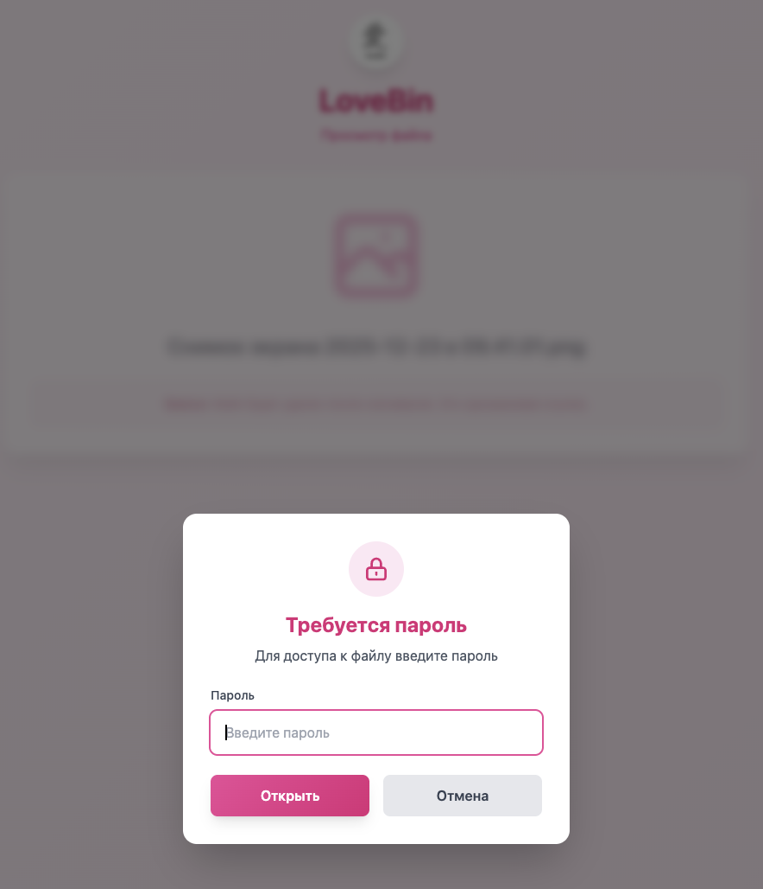
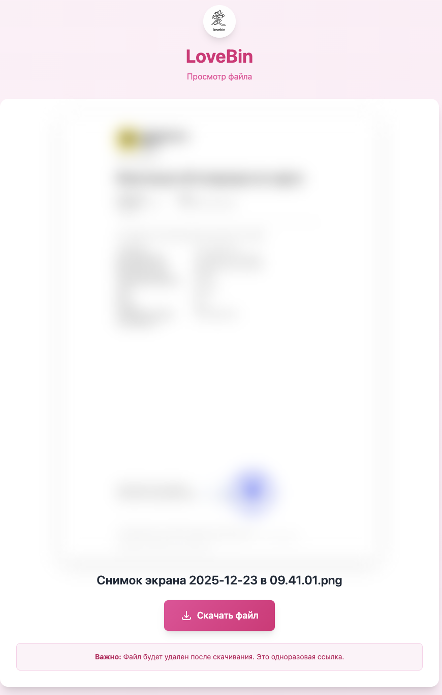
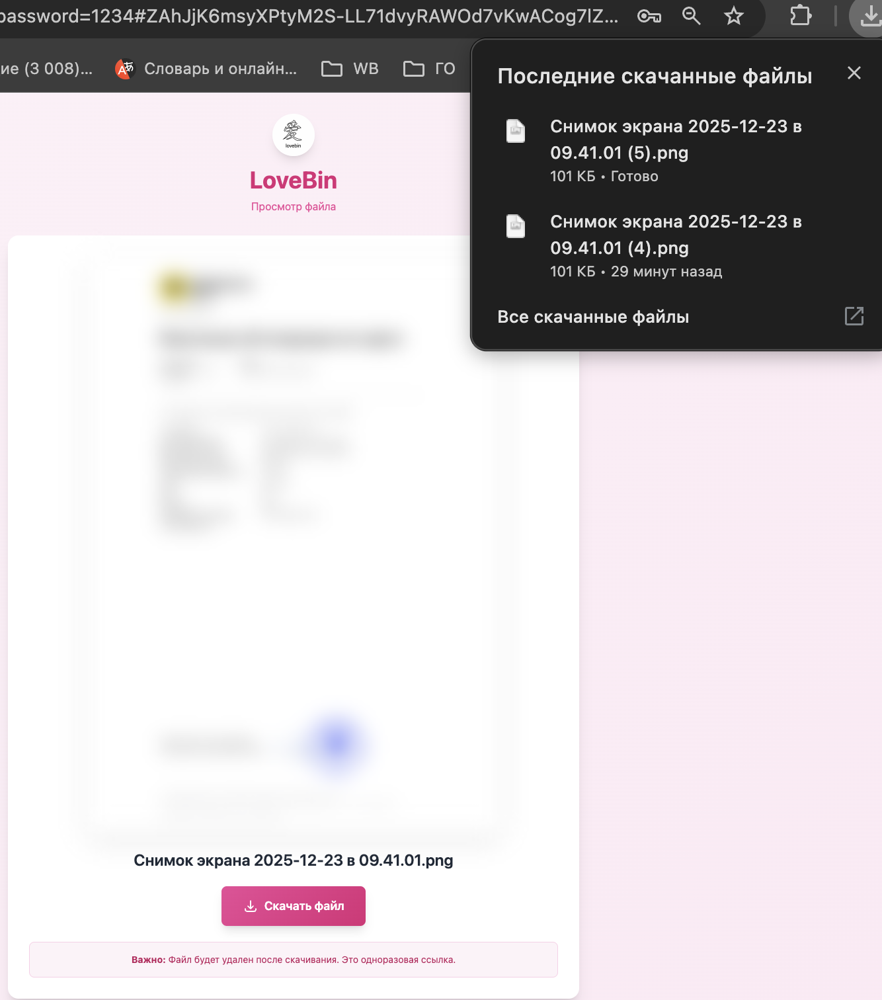
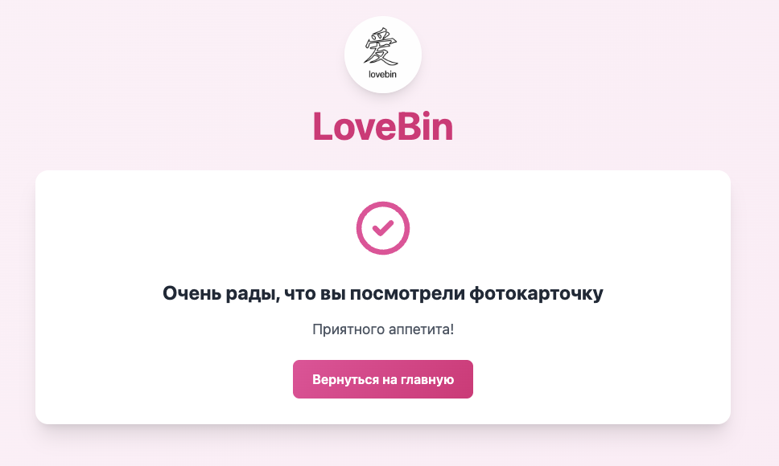

# LoveBin

Сервис обмена фотографиями и видео с шифрованием на стороне клиента, аналогичный PrivateBin.

## Особенности

- 🔒 Шифрование данных на стороне клиента (AES-256-GCM)
- 🔐 Опциональная защита паролем
- ⏰ Настраиваемое время жизни ресурсов
- 👁️ Одноразовый просмотр (ресурс недоступен после первого просмотра)
- 📦 Хранение зашифрованных медиа в S3
- 🗄️ Метаданные в PostgreSQL

## Архитектура

### Модули (`modules/`)
- `logger` - единая точка инициализации zap логгера
- `postgres` - PostgreSQL клиент
- `s3` - S3 клиент для хранения медиа
- `encryption` - криптографические функции

### Сервисы (`internal/services/`)
- `media-service` - основной сервис для работы с медиа (загрузка, скачивание)
- `access-service` - сервис для управления доступом (пароли, проверка доступа)

### API (`internal/api/`)
- HTTP handlers для Fiber

### Приложение (`internal/app/`)
- Конструктор приложения, инициализирующий все модули и сервисы

## Безопасность

- Все данные шифруются на стороне сервера перед сохранением в S3
- Ключ шифрования является частью URL (не хранится в БД)
- Пароли хешируются с помощью bcrypt
- Ресурсы помечаются как просмотренные после первого просмотра
- Поддержка истечения срока действия
- CORS

## Демонстрация работы

### 1. Загрузка файла

Главная страница позволяет загрузить файл с настройками:
- Пароль (опционально)
- Время жизни файла
- Размытие превью изображения

### 2. Защита паролем

Если файл защищен паролем, при попытке просмотра отображается модальное окно для ввода пароля.

### 3. Просмотр файла

После успешной авторизации (если требуется) отображается страница просмотра с:
- Превью изображения (если это изображение)
- Кнопкой для скачивания файла
- Информацией о файле

### 4. Скачивание файла

При нажатии на кнопку скачивания файл загружается на устройство пользователя.

### 5. Файл уже просмотрен

Если файл уже был просмотрен ранее, отображается специальное сообщение.

## Развертывание

Все файлы для Docker и развертывания находятся в папке `deploy/`:

- `deploy/Dockerfile` - Docker образ приложения
- `deploy/docker-compose-local.yml` - для локальной разработки
- `deploy/docker-compose.prod.yml` - для production
- `deploy/nginx/` - конфигурация Nginx
- `deploy/setup.sh` - скрипт первоначальной настройки сервера
- `deploy/deploy.sh` - скрипт развертывания

Подробная документация по развертыванию находится в `deploy/DEPLOYMENT.md` и `deploy/README.md`.
